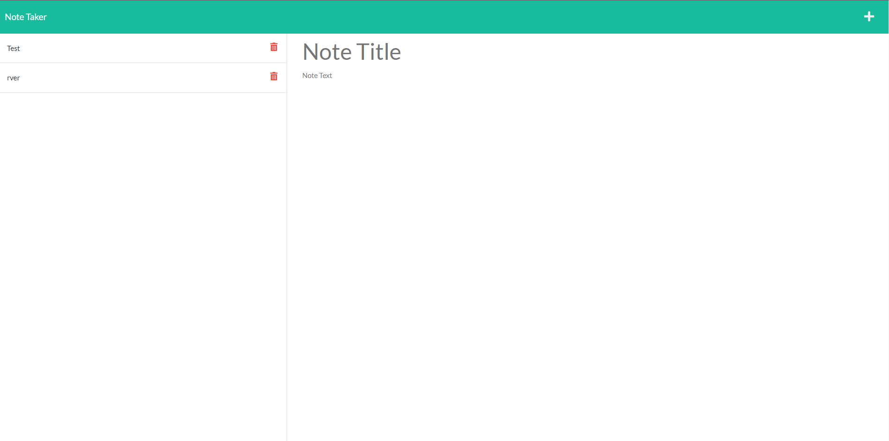

# note-taker

## Description

This application was made to help people store and save notes. When a user enters a title and description and click save, the note will be saved on the left. The user can save as many notes as they would like and can also delete any note they would like. If a user is to exit and re-open the site, the previous notes will still be available to view.

## Table of Contents

- [Installation](#installation)
- [Usage](#usage)
- [License](#license)
- [Contributing](#contributing)
- [Tests](#tests)
- [Questions](#questions)

## Installation

To install, the user needs to clone the repo and run node server.js

## Usage

Visit Site - https://shrouded-dawn-26525.herokuapp.com/

Run "node server.js" and use insomnia to view or visit heroku link.

## License

This project is license under MIT

## Contributing

At this time there is no need to contribute.

## Tests

node server.js

## Questions

If you have any questions, please email me at Tyler.Kand2@gmail.com. You can also view more of my work at https://github.com/TylerKandarian.
